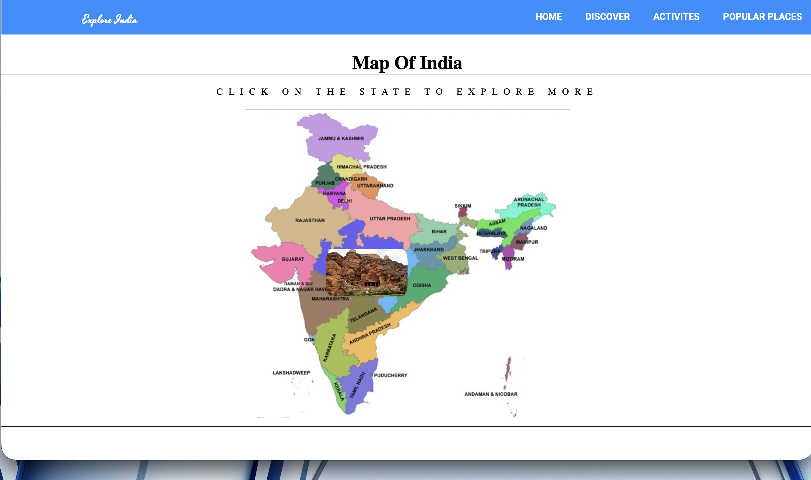
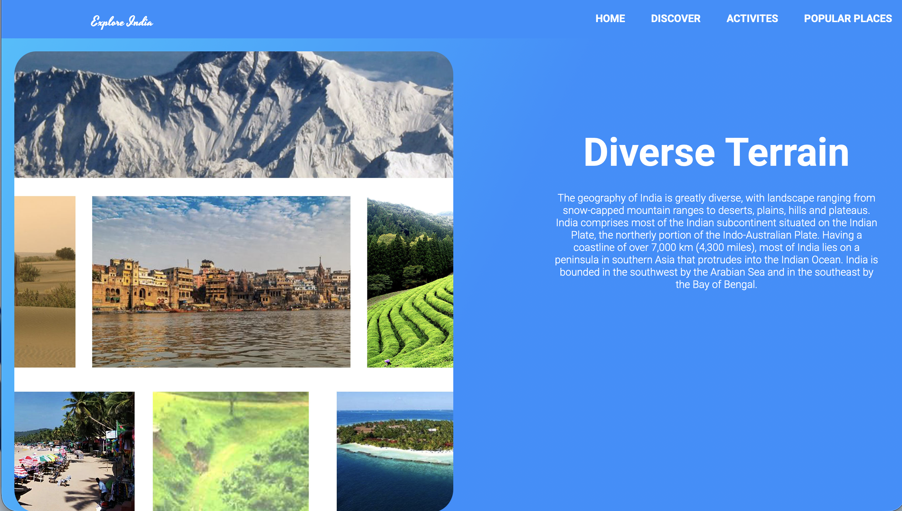
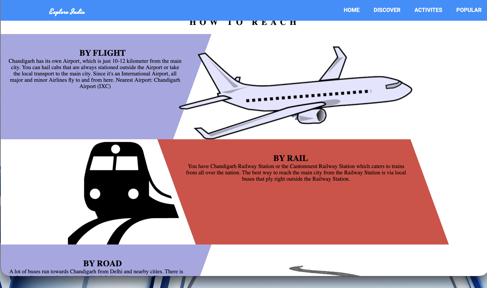

# Explore India: An Interactive Cultural & Geospatial Guide

* An immersive web platform designed to showcase the diverse heritage, tourist destinations, and regional specialties across India's 29 states and Union Territories. This project bridges the gap between interactive data visualization and tourism logistics.

* Unlike standard informational websites, Explore India is built with a focus on visual storytelling. By combining a sophisticated color palette with an interactive map, this platform transforms flat data into an engaging cultural journey. Every component—from the "Diverse Terrain" showcase to the "Culinary Guide"—is hand-crafted for maximum aesthetic impact and cross-device responsiveness.

* A high-performance cultural discovery platform featuring an interactive geospatial SVG map of India. This project prioritizes premium aesthetics with customized UI components, responsive layouts for diverse data visualization, and a seamless event-driven user experience.


## 📸 Project Showcases

| Main Landing View |
| :---: |
|  |

| Main View | Interactive Map Interface |
| :---: | :---: |
|  |  |

| Cultural & Culinary Guide | Adventure Activities  |
| :---: | :---: |
|  |  |

| Diverse Terrain Highlights | Travel Logistics  |
| :---: | :---: |
|  |  |


## ✨ Key Features
* **Geospatial Interactivity:** A fully responsive, clickable SVG map of India. Users can perform a "deep-dive" into specific states to unlock localized data.
* **Diverse Terrain Mapping:** Dedicated sections for snow-capped mountains, tropical coastal regions, arid deserts, and plains.
* **Cultural & Culinary Insights:** A visual guide to regional artifacts and ethnic cuisines (e.g., South Indian breakfast, Gujarati snacks).
* **Travel Logistics Engine:** Integrated guides for reaching destinations via Flight, Rail, and Road, with specific connectivity data for major hubs like Chandigarh.
* **Adventure Highlights:** Showcases specialized tourism categories including skiing, paragliding, trekking, and wildlife safaris.

## Professional Bullet Points
* **Aesthetic & UI Customization:** Engineered a visually immersive interface with custom-themed CSS, utilizing advanced Flexbox/Grid layouts to present complex cultural and geographical datasets with a modern, high-end aesthetic.

* **Geospatial Data Mapping:** Developed an interactive SVG-based map of India that serves as the primary navigation engine, using optimized JavaScript event listeners to deliver state-specific tourism and logistical data.

* **Logistical Integration:** Built comprehensive travel modules for 29 states, integrating multi-modal transport guides (Flight, Rail, Road) and specialized adventure activity showcases (Skiing, Paragliding, Trekking).


## 🛠️ Advanced Technical Stack & Engineering Standards

This project implements professional-grade engineering patterns to ensure high performance, maintainability, and a premium user experience.

### 🎨 Frontend Architecture & UI/UX
* **HTML5 Semantic Markup**: Utilized for SEO optimization and accessibility (ARIA labels) to ensure a screen-reader-friendly experience.
* **Modern CSS3 (Core Engine)**: Leveraged **CSS Variables** for dynamic theme customization and the **BEM (Block Element Modifier)** methodology for modular, scalable styling.
* **Advanced Layout Engines**: Implemented a hybrid of **CSS Grid** for complex imagery and **Flexbox** for responsive navigation components.
* **Aesthetic Customization**: Custom-built UI with **glassmorphism** effects, backdrop filters, and smooth state transitions for a high-end feel.

### 🗺️ Geospatial & Interactivity
* **SVG Path Manipulation**: Hand-coded and optimized SVG paths for the interactive India map to ensure zero-loss scaling on 4K/Retina displays.
* **ES6+ JavaScript Engine**: Used modern syntax including **Destructuring**, **Template Literals**, and **Arrow Functions** for performant DOM manipulation.
* **Event Delegation**: Optimized memory usage and performance by using a single event listener on the parent SVG to handle state-specific interactions.

### 🚀 DevOps & Performance
* **CI/CD Pipeline**: Automated deployment workflow via **GitHub Pages**, ensuring the production site stays synced with the `main` branch.
* **Image Optimization**: Implemented **Native Lazy Loading** and optimized assets to minimize First Contentful Paint (FCP) and improve Core Web Vitals.
* **Responsive Engineering**: Followed a **Mobile-First** approach using Media Queries to support all screen breakpoints from 320px to Ultra-Wide monitors.

## 📂 Project Structure
```text
explore-india/
├── index.html          # Main landing page & architecture
├── style.css           # Custom thematic styling & responsive layouts
├── script.js          # Interactive map logic & data handling
├── assets/             # Optimized travel imagery and icons
└── README.md           # Documentation
